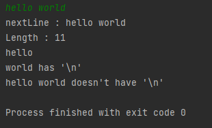

# next()와 nextLine()의 차이

> next() : 공백으로 입력을 구분하며 개행문자를 무시한다.
>
> nextLine() : 개행문자로 입력을 구분하며 개행문자로 입력을 구분하기 때문에 개행문자 까지를 입력으로 받고 개행문자를 제외한 나머지를 리턴한다.

백준 정렬 문제를 풀다가 문자열을 입력받을 때 에러가 발생했다. [전체 코드](https://github.com/mynameisjinwon/TIL/blob/main/Java/Algorithm/baekjoon/2.%EC%A0%95%EB%A0%AC/baekjoon10825.java)


```java
public static void input() {
    String name;
    int k, e, m;
    N = sc.nextInt();
    students = new Student[N];
    
    for(int i=0;i<N;i++) {
        name = sc.nextLine();
        k = sc.nextInt();
        e = sc.nextInt();
        m = sc.nextInt();

        students[cnt++] = new Student(name, k, e, m);
    }
}
```

nextLine()으로 문자열을 받을 때


nextInt() 메소드는 정수를 읽는 메소드, 개행문자는 읽지 않는다. 

사용자가 정수 5를 입력하기위해 정수 5와 엔터를 누르면 버퍼에는 "5\n"이 남아있게 되고 nextInt()메소드는 정수인 5만 입력으로 받아 버퍼에는 "\n"가 남게 된다.

버퍼에 남아있는 개행문자는 nextLine()메소드가 받아들여 name변수에는 개행문자가 저장이되고 사용자가 입력할 기회는 사라진다.

#### 해결방법

1. nextInt()로 정수를 입력받고 버퍼에 남아있는 개행문자를 없애기위해 nextLine()메소드를 호출한다.

```java
public static void input() {
String name;
int k, e, m;
N = sc.nextInt();
sc.nextLine();
students = new Student[N];

for(int i=0;i<N;i++) {
    name = sc.nextLine();
    k = sc.nextInt();
    e = sc.nextInt();
    m = sc.nextInt();
    sc.nextLine();

    students[cnt++] = new Student(name, k, e, m);
}
```

2. nextLine() 대신 next() 메소드를 사용해 문자열을 입력받는다.

```java
public static void input() {
String name;
int k, e, m;
N = sc.nextInt();
students = new Student[N];

for(int i=0;i<N;i++) {
    name = sc.next();
    k = sc.nextInt();
    e = sc.nextInt();
    m = sc.nextInt();

    students[cnt++] = new Student(name, k, e, m);
}
```

nextLine()메소드는 개행문자까지 입력을 받지만 next()메소드는 nextInt()와 마찬가지로 개행문자를 무시하고 입력을 받는다.

3. Integer.parsInt() 메소드를 사용해 int를 입력받는다.

```java
public static void input() {
    String name;
    int k, e, m;
    System.out.print("N : " );
    N = Integer.parseInt(sc.nextLine());
    students = new Student[N];

    for(int i=0;i<N;i++) {
        name = sc.nextLine();
        k = Integer.parseInt(sc.nextLine());
        e = Integer.parseInt(sc.nextLine());
        m = Integer.parseInt(sc.nextLine());

        students[cnt++] = new Student(name, k, e, m);
    }
}
```

Integer.parseInt() 메소드의 인자로 sc.nextLine()메소드의 리턴값을 전달한다. nextLine()메소드는 버퍼에 기록된 내용을 개행문자까지 읽는다. parseInt()메소드는 인자로 받은 값을 정수로 리턴한다.


#### nextLint()은 개행문자를 포함하지는 않는다.

```java
import java.util.Scanner;

public class Test {
    public static void main(String[] args) {
        Scanner sc = new Scanner(System.in);

        String nextLine = sc.nextLine();
        String test = "hello\nworld";
        System.out.println("nextLine : " + nextLine + "\nLength : " + nextLine.length());

        if(test.contains("\n"))
            System.out.println(test + " has '\\n'");
        else
            System.out.println(test + " doesn't have '\\n'");

        if(nextLine.contains("\n"))
            System.out.println(nextLine +" has '\\n'");
        else
            System.out.println(nextLine + " doesn't have '\\n'");
    }
}
```

nextLine()메소드는 버퍼에 입력된 데이터를 개행문자 단위로 구분해 입력을 받지만 개행문자 자체를 받아들이는 것은 아니다. 

#### 실행결과



